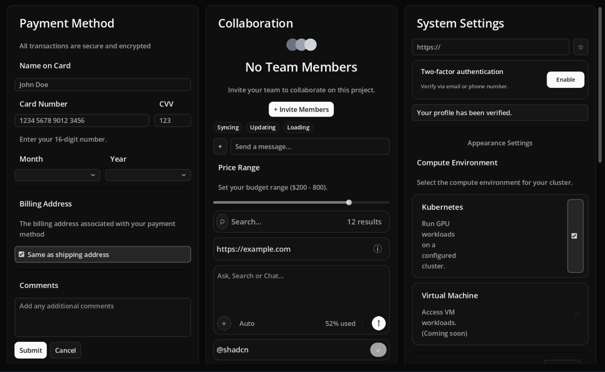
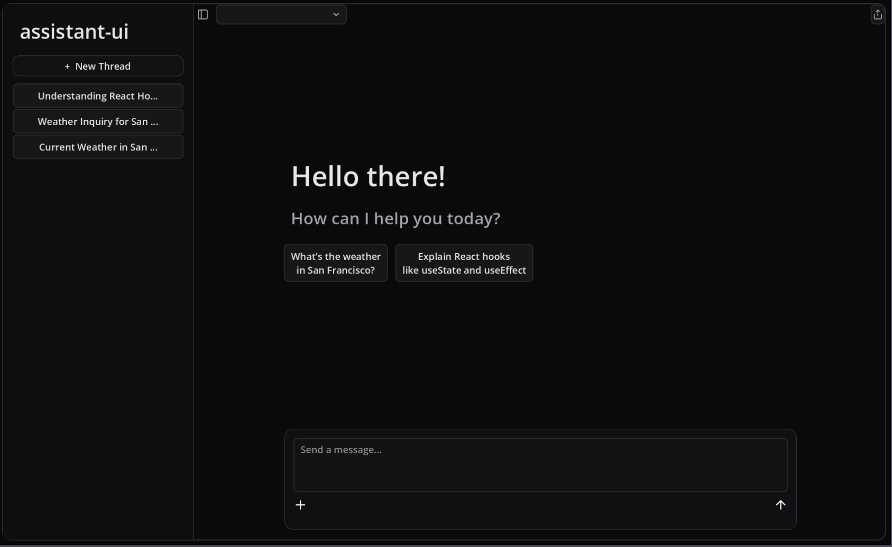

# Godot Shadcn UI Kit

[English](README.md)

一个暗色、shadcn 风格的 Godot UI 示例工程，提供两套同步实现：
- 运行时动态创建 UI（`GDScript`）
- 可编辑静态场景 UI（`.tscn`）

## 特性
- shadcn 风格暗色主题（`demo/shadcn_dark_theme.tres`）
- 运行时代码版与静态场景版双轨维护
- 根据视口宽度自适应卡片列数
- 输入控件可在游戏内正常编辑
- 运行时避免调用编辑器专用 API

## 项目结构
```text
.
├─ demo/
│  ├─ project.godot
│  ├─ main.tscn
│  ├─ gallery.gd
│  ├─ main_static.tscn
│  ├─ gallery_static.gd
│  ├─ shadcn_dark_theme.tres
│  └─ bake_static_from_code.gd
├─ .agent/skill/SKILL.md
└─ agent.md
```

## 快速开始
1. 使用 Godot 4.6（或兼容 4.x）打开 `demo/project.godot`。
2. 运行项目，查看运行时代码版 UI（`main.tscn`）。
3. 在编辑器中打开 `demo/main_static.tscn`，编辑静态版本。
4. 打开 `demo/chat_ui.tscn` 查看 AI 聊天 UX 场景。

## 截图
### Gallery 场景


### AI Chat 场景


## 运行时版与静态版
- 运行时主实现：`demo/gallery.gd`
- 可编辑静态镜像：`demo/main_static.tscn`
- 静态版响应式逻辑：`demo/gallery_static.gd`

新增或修改组件时，需要同时更新两套实现，保持结构和行为一致。

## AI 维护规范
- AI 使用说明书：`agent.md`
- 技能说明：`.agent/skill/SKILL.md`

以上文件定义了 AI 代理在本项目中的维护规则与流程。

## 许可证
MIT
